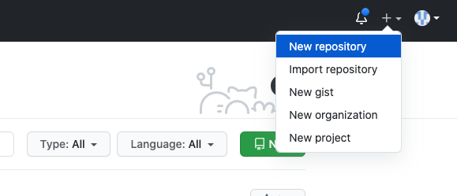
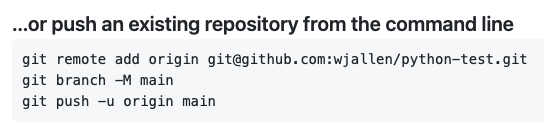

Version Control with Git: Part 2
================================

In the first Git module, we learned to work independently with Git repositories
on the local command line. In this second part, we will focus on using the GitHub
web interface and collaborating with others.

Link a Local Repository to GitHub
---------------------------------

Version control really comes into its own when we begin to collaborate with
other people.  We already have most of the machinery we need to do this; the
only thing missing is to copy changes from one repository to another.

Systems like Git allow us to move work between any two repositories.  In
practice, though, it's easiest to use one copy as a central hub, and to keep it
on the web rather than on someone's laptop.  Most programmers use hosting
services like GitHub, Bitbucket, or GitLab to hold those main copies.

Let's start by sharing the changes we've made to our current project with the
world. Log in to GitHub, then click on the icon in the top right corner to
create a new repository:

   Click 'New repository'.

As soon as the repository is created, GitHub displays a page with a URL and some
information on how to configure your local repository. Provide a name for your
new repository like ``python-test`` (or whatever you want, it doesn't have to
match the name of your local folder).

Note that our local repository still contains our earlier work on ``python_test_1.py``
and other files, but the remote repository on GitHub doesn't contain any memory
of ``python_test_1.py`` yet. The next step is to connect and sync the two repositories.
We do this by making the GitHub repository a "remote" for the local repository. The
home page of the repository on GitHub includes the string we need to identify it:

   Follow the instructions for pushing an existing repository.

Back on ISP in the local Git repo, link it to the repo on GitHub and confirm the
link was created:

.. code-block:: console

   [isp02]$ git remote add origin git@github.com:wjallen/python-test.git
   [isp02]$ git remote -v
   origin  git@github.com:wjallen/python-test.git (fetch)
   origin  git@github.com:wjallen/python-test.git (push)

.. attention::

   Make sure to use the URL for your repository instead of the one listed here.

The name ``origin`` is a local nickname for your remote repository. We could use
something else if we wanted to, but ``origin`` is by far the most common choice.

Another key step is to set up SSH keys for authentication. GitHub no longer
allows simple username / password authentication from the command line. To set
up SSH keys, click on:

Your account => Settings => SSH and GPG keys => New SSH key

In the "Title" box, add a memorable name for this key like "isp02". In the "Key"
box, cut and paste the contents of your existing public key on the class server.
You can find it by executing the command:

.. code-block:: console

   [isp02]$ cat ~/.ssh/id_rsa.pub
   ssh-rsa AAAAB3NzaC1yc2EAAAADAQABAAABAQDF8crdmqgk2GhRmsLPcREWjzc9zb2B....
   ........................................................................

Once the SSH key is set up, this command will push the changes from our local
repository to the repository on GitHub:

.. code-block:: console

   [isp02]$ git branch -M main
   [isp02]$ git push -u origin main
   Warning: Permanently added the ECDSA host key for IP address '140.82.112.4' to the list of known hosts.
   Counting objects: 3, done.
   Delta compression using up to 8 threads.
   Compressing objects: 100% (2/2), done.
   Writing objects: 100% (3/3), 223 bytes | 0 bytes/s, done.
   Total 3 (delta 0), reused 0 (delta 0)
   To git@github.com:wjallen/python-test.git
    * [new branch]      main -> main
   Branch main set up to track remote branch main from origin.

Now that the repositories are synced, your development workflow has evolved to
include the ``git push`` operation. From here on, if you make changes to your code,
you can expect to follow the changes with the commands:

.. code-block:: console

   # Make some edits to "example_file.py"
   [isp02]$ git status
   [isp02]$ git add example_file.py
   [isp02]$ git commit -m "description of changes"
   [isp02]$ git push

Clone the Repository
--------------------

Spend a few minutes browsing the web interface for GitHub. Now, anyone can make
a full copy of ``my_first_repo`` including all the commit history by performing:

.. code-block:: console

   [isp02]$ git clone git@github.com:wjallen/python-test.git
   Cloning into 'python-test'...
   remote: Enumerating objects: 15, done.
   remote: Counting objects: 100% (15/15), done.
   remote: Compressing objects: 100% (10/10), done.
   remote: Total 15 (delta 4), reused 15 (delta 4), pack-reused 0
   Unpacking objects: 100% (15/15), done.

If the repository on GitHub gets ahead of your local repository, i.e. it has some
changes in it that someone else pushed from somewhere else, or you pushed from a
different machine, then you can try to update your local repository to pull the
changes back down.

.. code-block:: console

   [isp02]$ git remote update    # checks to see if there are updates in the remote
   [isp02]$ git pull             # pulls those updates down to local

.. warning::

   If you have changes in local files that conflict with the remote repository
   (i.e. the repository on GitHub), the ``git pull`` will fail and you have
   found your way into a "merge conflict".
   `Good luck! <https://docs.github.com/en/pull-requests/collaborating-with-pull-requests/addressing-merge-conflicts>`_

Git / Version Control Concepts
------------------------------

Let's take a quick intermission to lean some important definitions (most of these
things can easily be managed in the GitHub web interface):

Fork
~~~~

A fork is a personal copy of another user's repository that lives on your
account. Forks allow you to freely make changes to a project without affecting
the original. Forks remain attached to the original, allowing you to submit a
pull request to the original's author to update with your changes. You can also
keep your fork up to date by pulling in updates from the original.

Branch
~~~~~~

A branch is a parallel version of a repository. It is contained within the
repository, but does not affect the primary or main branch allowing you to
work freely without disrupting the "live" version. When you've made the changes
you want to make, you can merge your branch back into the main branch to
publish your changes. For more information, see
`About branches <https://help.github.com/articles/about-branches>`_.

Tag
~~~

Git has the ability to tag specific points in history as being important.
Typically people use this functionality to mark release points (v1.0, and so
on).

Pull Request / Merge Request
~~~~~~~~~~~~~~~~~~~~~~~~~~~~

Pull requests are proposed changes to a repository submitted by a user and
accepted or rejected by a repository's collaborators. Like issues, pull requests
ach have their own discussion forum. For more information, see `About pull
requests <https://help.github.com/articles/about-pull-requests>`_.

Collaborating with Others
-------------------------

A public platform like GitHub makes it easier than ever to collaborate with
others on the content of a repository. You can have as many local copies of a
repository as you want, but there is only one "origin" repository - the
repository hosted on GitHub. Other repositories may fall behind the origin, or
have changes that are ahead of the origin. A common model for juggling multiple
repositories where separate individuals are working on different features is the
`GitFlow model <https://datasift.github.io/gitflow/IntroducingGitFlow.html>`_:

.. figure:: ./images/GitFlowMasterBranch.png
   :width: 500px
   :align: center

   GitFlow model

EXERCISE
~~~~~~~~

Let's work on a **branch** plus **pull request** in the GitHub web interface.

* Locate and navigate to your repository
* Click on the branch / tag navigator near the top right and start typing in a
  new name to create a new branch
* By default, it should switch you to the new branch. Click on one of your files
  and edit it (e.g. add a comment) directly in the web interface
* Navigate to the "Pull requests" tab and click on "New pull request"
* Make sure to select the original branch "main" as the base, and your new branch
  as the downstream for comparison
* Review the code changes and make everything is as expected before choosing
  "Create pull request"
* Now the owner of the repository (you) can accept the pull request, merging
  the edits into the main branch

What are the differences between a "merge commit", "squash and merge", and "rebase
and merge"? The differences are subtle. All will result in the edits getting
merged into the main branch. It is mostly a stylistic thing, and the best method
depends on whatever the rest of developers agree to use. More info on the
differences `here <https://rietta.com/blog/github-merge-types/>`_.

EXERCISE
~~~~~~~~

Let's next work on a **fork** plus **pull request** in the GitHub web interface.

* Navigate to this repository: https://github.com/jagaither/coe-332-forking-demo
* Click the "Fork" button near the top right and fork it to your own user space
* Now you could either ``git clone`` your fork to isp02, put in a new file, then
  ``git add`` => ``git commit` => ``git push``; OR you could click "Add file" in
  the GitHub web interface and create a new file that way
* Navigate again to the "Pull requests" tab and click to create a "New pull request"
* Make sure the original repo (``jagaither``) is set as the base and your fork
  is set as the head
* Create the pull request and provide enough detail for the repository owner
  (``jagaither``) to know whether he should accept your pull request or not

Consult the documentation in the base repository (if documentation exists) and
look out for general guidance for contributors. If you develop a new feature and
it is merged back into the base, you can generally just delete your fork.

Other Considerations
--------------------

Most repos will also contain a few standard files in the top directory,
including:

**README.md**: The landing page of your repository on GitHub will display the
contents of README.md, if it exists. This is a good place to describe your
project and list the appropriate citations. *Please note that all of your
homeworks, midterm, and final will require READMEs*.

**LICENSE.txt**: See if your repository needs a license
`here <https://help.github.com/articles/licensing-a-repository/>`_.

Additional Resources
--------------------

* Some of the materials in this module were based on `Software Carpentry <https://github.com/swcarpentry/git-novice>`_ DOI: 10.5281/zenodo.57467.
* `GitHub Glossary <https://help.github.com/articles/github-glossary/>`_
* `About Branches <https://help.github.com/articles/about-branches>`_
* `About Pull Requests <https://help.github.com/articles/about-pull-requests>`_
* `About Licenses <https://help.github.com/articles/licensing-a-repository/>`_
* `GitFlow Model <https://datasift.github.io/gitflow/IntroducingGitFlow.html>`_
* `More on different git workflows <https://www.atlassian.com/git/tutorials/comparing-workflows>`_
