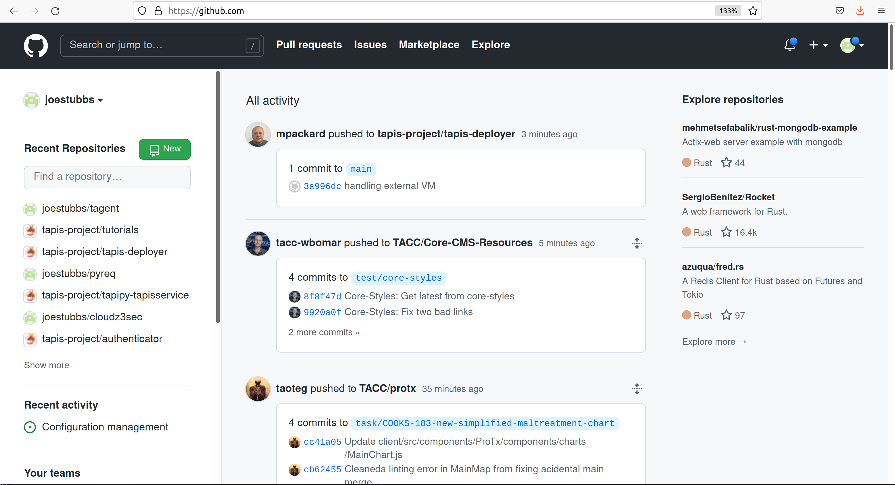
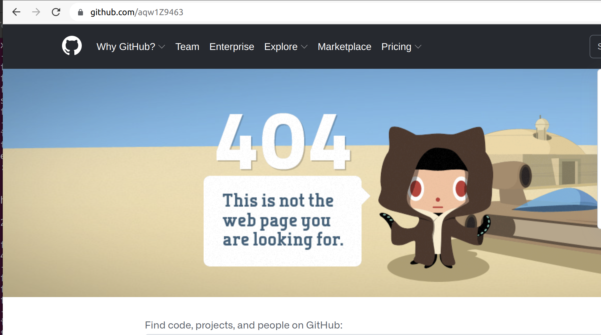
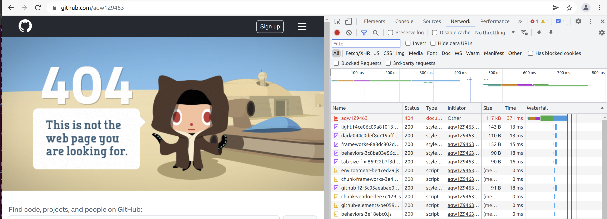

Introduction to APIs
=====================
In this section, we will discuss Application Programming Interfaces (APIs)
focusing on Web APIs, and in particular REST APIs. We
will learn how to interact with APIs using Python scripts. After going through
this module, students should be able to:

* Identify and describe Web APIs (including REST APIs).
* List the four most important HTTP verbs and define how they are used in REST APIs.
* Describe how URLs are used to represent objects in a REST API.
* Explore API endpoints provided by various websites, e.g., GitHub.
* Install the Python requests library, and use it to interact with a web API in a Python script,
  including making requests and parsing responses.

An Application Programming Interface (API) establishes the protocols and methods
for one piece of a program to communicate with another. APIs are useful for:

(1) Allowing larger software systems to be built from smaller components,
(2) Allowing the same component/code to be used by different systems, and
(3) Insulating consumers from changes to the implementation.

Some examples of APIs:

* In OOP languages, abstract classes provide the interface for all concrete
  classes to implement.
* Software libraries provide an external interface for consuming programs.
* Web APIs (or “web services”) provide interfaces for computer programs to
  communicate over the internet.

While a User Interface connects humans to computer programs, an API is an interface
that connects one piece of software to another.

APIs:

  (1) Provide functionality to external software in the form of a contract that specifies
      the inputs that the consuming software must provide and the outputs that the API
      will produce from the inputs.
  (2) Conceal the implementation of this functionality from the consuming software so
      that changes can be made to the implementation without impacting consumers.
  (3) Provide errors when the consuming software doesn't fulfill the contract of the API or when
      unexpected circumstances are encountered.

We have already been working with APIs. For example, the Python ``json`` library
presents us with an API for working with JSON data.

.. code-block:: python3

    >>> import json
    >>> dir(json)
    ['JSONDecodeError',
    'JSONDecoder',
    'JSONEncoder',
    . . .
    'codecs',
    'decoder',
    'detect_encoding',
    'dump',
    'dumps',
    'encoder',
    'load',
    'loads',
    'scanner']

We use ``json.dumps()`` to convert Python objects to JSON (string) data and we use
``json.loads()`` to convert JSON strings to Python objects.

.. code-block:: python3

    >>> json.dumps({'a': 1})
    '{"a": 1}'
    >>> type(_)
    str
    >>> json.loads('{"a": 1}')
    {'a': 1}
    >>> type(_)
    dict

We say that ``dumps`` and ``loads`` are part of the Python ``json`` API. In terms of the
contract, we might say something like:

  * ``json.loads()`` -- This function accepts a single input (string, bytes or bytes array) representing
    a valid JSON document and returns the equivalent Python object.
  * It will raise a ``JSONDecodeError`` if the input is not a valid JSON document.
  * ``json.dumps()`` -- This function accepts a single input (a Python object) and serializes
    it to a string. The Python object must be JSON serializable.
  * It will raise a ``TypeError`` if the input is not JSON serializable.

Web APIs
--------

In this course, we will be building Web APIs or HTTP APIs. These are interfaces
that are exposed over HTTP, allowing them to be consumed by software running on different
machines.

There are a number of advantages to Web-based APIs
that we will use in this class:

* A Web API can be made accessible to any computer or application that can access
  the public internet. Alternatively, a Web API can be restricted to a private network.
* No software installation is required on the client's side to consume a web API.
* Web APIs can change their implementation without clients knowing (or caring).
* Virtually every modern programming language provides one or more libraries for
  interacting with a web API; thus, Web APIs are "programming language agnostic".

HTTP - the Protocol of the Internet
-----------------------------------

HTTP (Hyper Text Transfer Protocol) is one way for two computers on the internet
to communicate with each other. It was designed to enable the exchange of data
(specifically, "hypertext"). In particular, our web browsers use HTTP when
communicating with web servers running web applications. HTTP uses a
message-based, **client-server model**: clients make requests to servers by
sending a message, and servers respond by sending a message back to the client.

HTTP is an "application layer" protocol in the language of the
Internet Protocols; it assumes a lower level transport layer protocol. While
this can swapped, in practice it is almost always TCP. The basics of the
protocol are:

* Web resources are identified with URLs (Uniform Resource Locators).
  Originally, **resources** were just files/directories on a server, but today
  resources refer to more general objects.
* HTTP "verbs" represent actions to take on the resource. The most common verbs
  are ``GET``, ``POST``, ``PUT``, and ``DELETE``.
* A **request** is made up of a URL, an HTTP verb, and a message
* A **response** consists of a status code (numerical between 100-599) and a
  message. The first digit of the status code specifies the kind of response:

    * 1xx - informational
    * 2xx - success
    * 3xx - redirection
    * 4xx - error in the request (client)
    * 5xx - error fulfilling a valid request (server)

Web Page Examples
-----------------
Open a browser window, type ``https://github.com`` into the address bar and hit go.
We see the GitHub home page which looks something like this:

In fact, a multi-step process just occurred; here is a slightly simplified version of what
happened:

  (1) Your browser made an HTTP GET request to https://github.com.
  (2) A GitHub server received the request from your browser, formulated a response message
      containing the data (in HTML format) of your home page, with a 200 response code
      to indicate success.
  (3) Your browser received the response message from the GitHub server, and determined that
      the request was successful, due to the 200 response code.
  (4) It then drew the HTML message in the browser window.

If enter a URL that GitHub doesn't recognize, we get a page that looks like this:

Most browsers have tools for determining what requests and responses were made. For example,
in Chrome, we can use "More tools -> Developer Tools" from the Customize and Control menu
(the three dots in the top-right corner), to open up a panel for introspecting the requests
being made.

If we click the "Network" tab and try our request again, we will see something like this:

The top row in red represents the request to ``https://github.com/aqw1Z9463`` and it shows
the status code of the response was 404.

REST APIs - Overview
--------------------

REST (Representational State Transfer) is a way of building APIs for computer
programs on the internet leveraging HTTP. In other words, a program on computer
1 interacts with a program on computer 2 by making an HTTP request to it and receiving HTTP
responses.

The basic idea with REST is to associate objects in the application domain with URLs,
and to use HTTP verbs to represent the actions we want to take on the objects.
A REST API has a **base URL** from which all other URLs in
that API are formed. For example, the base URL for the GitHub REST API which will look
at in more detail momentarily is ``https://api.github.com/``.

The other URLS in the API are then "collections", typically represented by a plural noun,
following the base URL; e.g.:

.. code-block:: console

   <base_url>/users
   <base_url>/files
   <base_url>/programs

or they are specific items in a collection, represented by an identifier following the
collection name, e.g.:

.. code-block:: console

   <base_url>/users/12345
   <base_url>/files/test.txt
   <base_url>/programs/myapplication

or subcollections or items in subcollections, e.g.:

.. code-block:: console

   <base_url>/companies/<company_id>/employees
   <base_url>/companies/<company_id>/employees/<employee_id>

As mentioned, the HTTP verbs represent “operations” or actions that can be taken
on the resources:

* ``GET`` - list items in a collection or retrieve a specific item in the
  collection
* ``POST`` - create a new item in the collection based on the description in the
  message
* ``PUT`` - replace an item in a collection with the description in the message
* ``DELETE`` - delete an item in a collection

Thus,

* GET ``<base_url>/users``  would list all users.
* POST ``<base_url>/users`` would create a new user.
* PUT ``<base_url>/users/12345`` would update user 12345.

The combination of an HTTP verb and URL (path) are called an **endpoint** in an API. A REST
API is typically comprised of many endpoints.

Note that not all HTTP verbs make sense for all URLs. For example, an API would probably not
include a PUT ``<base_url>/users`` endpoint, because semantically, that would mean updating
the entire list of users.

Response messages often make use of some data serialization format standard such
as JSON, CSV or XML.

REST APIs - Additional Simple Examples
--------------------------------------

Virtually every application domain can be mapped into a REST API architecture.
Some examples may include:

Articles in a collection (e.g., on a blog or wiki) with author attributes:

.. code-block:: console

   <base_url>/articles
   <base_url>/articles/<id>
   <base_url>/articles/<id>/authors

Properties in a real estate database with associated purchase history:

.. code-block:: console

   <base_url>/properties
   <base_url>/properties/<id>
   <base_url>/properties/<id>/purchases

A catalog of countries, cities and neighborhoods:

.. code-block:: console

   <base_url>/countries
   <base_url>/countries/<country_id>/cities
   <base_url>/countries/<country_id>/cities/<city_id>/neighborhoods

REST APIs - A Real Example
--------------------------
We have been using GitHub to host our class code repositories. It turns out GitHub
provides an HTTP API that is architected using REST (for the most part). We're going
to explore the GitHub API.

To begin, open a web browser and navigate to https://api.github.com

You will see something like this:

.. code-block:: console

  {
    "current_user_url": "https://api.github.com/user",
    "current_user_authorizations_html_url": "https://github.com/settings/connections/applications{/client_id}",
    "authorizations_url": "https://api.github.com/authorizations",
    "code_search_url": "https://api.github.com/search/code?q={query}{&page,per_page,sort,order}",
    "commit_search_url": "https://api.github.com/search/commits?q={query}{&page,per_page,sort,order}",
    "emails_url": "https://api.github.com/user/emails",
    "emojis_url": "https://api.github.com/emojis",
    "events_url": "https://api.github.com/events",
    "feeds_url": "https://api.github.com/feeds",
    "followers_url": "https://api.github.com/user/followers",
    "following_url": "https://api.github.com/user/following{/target}",
    "gists_url": "https://api.github.com/gists{/gist_id}",
    "hub_url": "https://api.github.com/hub",
    "issue_search_url": "https://api.github.com/search/issues?q={query}{&page,per_page,sort,order}",
    "issues_url": "https://api.github.com/issues",
    "keys_url": "https://api.github.com/user/keys",
    "label_search_url": "https://api.github.com/search/labels?q={query}&repository_id={repository_id}{&page,per_page}",
    "notifications_url": "https://api.github.com/notifications",
    "organization_url": "https://api.github.com/orgs/{org}",
    "organization_repositories_url": "https://api.github.com/orgs/{org}/repos{?type,page,per_page,sort}",
    "organization_teams_url": "https://api.github.com/orgs/{org}/teams",
    "public_gists_url": "https://api.github.com/gists/public",
    "rate_limit_url": "https://api.github.com/rate_limit",
    "repository_url": "https://api.github.com/repos/{owner}/{repo}",
    "repository_search_url": "https://api.github.com/search/repositories?q={query}{&page,per_page,sort,order}",
    "current_user_repositories_url": "https://api.github.com/user/repos{?type,page,per_page,sort}",
    "starred_url": "https://api.github.com/user/starred{/owner}{/repo}",
    "starred_gists_url": "https://api.github.com/gists/starred",
    "topic_search_url": "https://api.github.com/search/topics?q={query}{&page,per_page}",
    "user_url": "https://api.github.com/users/{user}",
    "user_organizations_url": "https://api.github.com/user/orgs",
    "user_repositories_url": "https://api.github.com/users/{user}/repos{?type,page,per_page,sort}",
    "user_search_url": "https://api.github.com/search/users?q={query}{&page,per_page,sort,order}"
  }

This should look familiar -- it's a JSON document, and it describes various collections of
endpoints in the GitHub API. For example, we see:

  * ``"events_url": "https://api.github.com/events",`` -- Work with GitHub events
  * ``"organization_url": "https://api.github.com/orgs/{org}",`` -- Work with GitHub orgs
  * ``"repository_url": "https://api.github.com/repos/{owner}/{repo}",`` -- Work with GitHub repos

Many of the endpoints within the GitHub API require *authentication*, i.e., that the requesting
application prove its identity -- we'll ignore this topic for now and just work with the
endpoints that do not require authentication.

Let's discover what the GitHub API can tell us about TACC's GitHub organization, which is
just called ``tacc``.

**EXERCISE**

Based on the information above, how would we retrieve information about the TACC GitHub
organization from the API? What HTTP verb and URL would we use?

**SOLUTION**

We see that the "organization_url" is defined to be ``"https://api.github.com/orgs/{org}"``.
The use of the ``{org}`` notation is common in API documentation -- it indicates a variable
to be substituted with a value. In this case, we should substitute ``tacc`` for ``{org}``,
as that is the organization we are interested in.

Since we want to retrieve (or list) information about the TACC organization, the HTTP verb
we want to use is GET.

We can use the browser to make this request, as before. If we enter
``https://api.github.com/orgs/tacc`` into the URL bar, we should see:

.. code-block:: console

  {
    "login": "TACC",
    "id": 840408,
    "node_id": "MDEyOk9yZ2FuaXphdGlvbjg0MDQwOA==",
    "url": "https://api.github.com/orgs/TACC",
    "repos_url": "https://api.github.com/orgs/TACC/repos",
    "events_url": "https://api.github.com/orgs/TACC/events",
    "hooks_url": "https://api.github.com/orgs/TACC/hooks",
    "issues_url": "https://api.github.com/orgs/TACC/issues",
    "members_url": "https://api.github.com/orgs/TACC/members{/member}",
    "public_members_url": "https://api.github.com/orgs/TACC/public_members{/member}",
    "avatar_url": "https://avatars.githubusercontent.com/u/840408?v=4",
    "description": "",
    "name": "Texas Advanced Computing Center",
    "company": null,
    "blog": "http://www.tacc.utexas.edu",
    "location": "Austin, TX",
    "email": null,
    "twitter_username": null,
    "is_verified": false,
    "has_organization_projects": true,
    "has_repository_projects": true,
    "public_repos": 152,
    "public_gists": 0,
    "followers": 0,
    "following": 0,
    "html_url": "https://github.com/TACC",
    "created_at": "2011-06-09T16:47:08Z",
    "updated_at": "2021-04-07T17:34:55Z",
    "type": "Organization"
  }

Using Python to Interact with Web APIs
--------------------------------------

Viewing API response messages in a web browser provides limited utility. We can
interact with Web APIs in a much more powerful and programmatic way using the
Python ``requests`` library.

First install the ``requests`` library in your local site-packages on the ISP server using
pip:

.. code-block:: console

   [isp02]$ pip3 install --user requests
   ...
   Successfully installed requests-2.25.1

You might test that the install was successful by trying to import the library
in the interactive Python interpreter:

.. code-block:: console

   [isp02]$ python3
   Python 3.6.8 (default, Aug  7 2019, 17:28:10)
   [GCC 4.8.5 20150623 (Red Hat 4.8.5-39)] on linux
   Type "help", "copyright", "credits" or "license" for more information.
   >>> import requests
   >>>

The basic usage of the ``requests`` library is as follows:

.. code-block:: python3

   >>> # make a request: typical format
   >>> # response = requests.<method>(url=some_url, data=some_message, <other options>)
   >>>
   >>> # e.g. try:
   >>> response = requests.get(url='https://api.github.com/orgs/tacc')
   >>>
   >>> # return the status code:
   >>> response.status_code
   >>>
   >>> # return the raw content
   >>> response.content
   >>>
   >>> # return a Python list or dictionary from the response message
   >>> response.json()

**EXERCISE**

Let's use ``requests`` to explore the GitHub API. Write functions to return the following:

* Given a GitHub organization id, retrieve all information about the organization. Return
  the information as a Python dictionary.
* Given a GitHub organization id, retrieve a list of all of the members of the organization.
  Return the list of members as a Python list of strings, where each string contains the member'same
  ``login`` (i.e., GitHub username) attribute.
* Given a GitHub organization id, return a list of repositories controlled by the organization.
  Return the list f repositories as a Python list of strings, where each string contains the
  repository ``full_name`` attribute.
