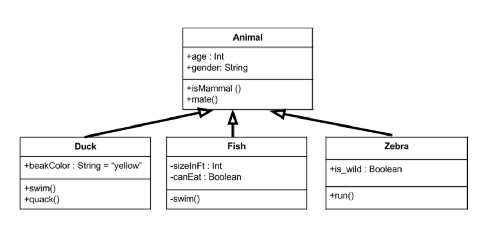
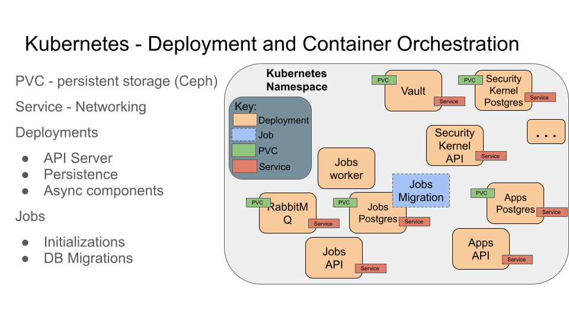
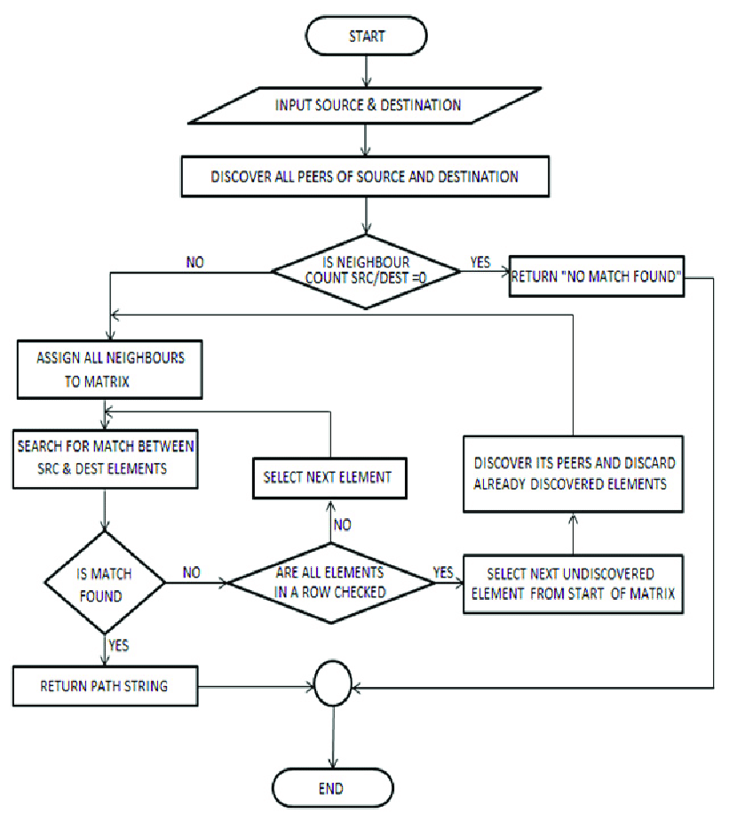
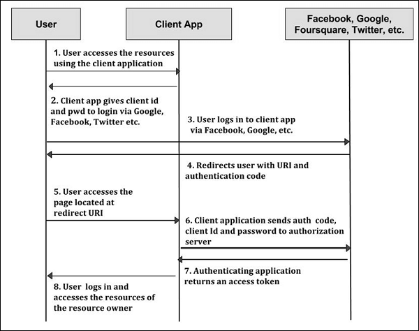
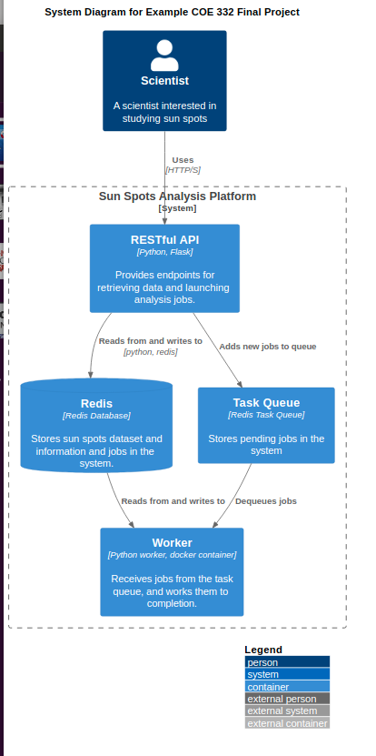
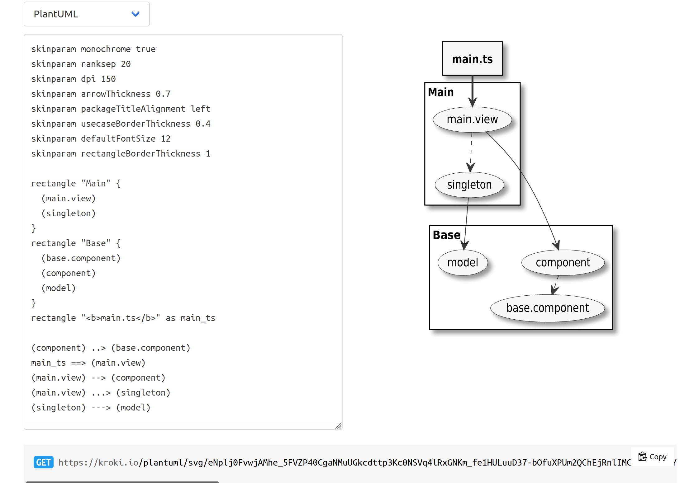

Diagrams for Software Design
=============================

In this module, we provide a brief introduction to diagrams for software design. By the end 
of this module, the student should be able to:

  * Explain the basic utility of diagrams for software design
  * Describe the differences between structural diagrams and behavioral diagrams. 
  * Create different types of structural and/or behavioral diagrams for their flask-based API system.

As a software system grows in its size and complexity, it becomes increasingly difficult to describe in 
written text. Diagrams help us visualize the components of a software system, allowing us to provide a
more concise and holistic description. There are many tools and approaches to creating diagrams for software 
systems. In this short module, we provide only a brief introduction to diagrams for software design, and
we include some references for further reading. 

Generally speaking, a diagram can convey two types of information:

  * Static relationships between components, sometimes called a structural diagram.
  * Dynamic information describing how the system changes or how different components react to 
    each other. These are called behavior diagrams.

Structural Diagrams
-------------------

With a structural diagram, the goal is to represent the components of the system with different shapes, 
and to indicate connections between the components, usually with an arrow. Different diagrams will
represent different types of components in the system at different granularity.
For example, we could use boxes to represent:

  * Classes in software utilizing object oriented programming
  * Modules and libraries in a large code base 
  * Containers or services in a distributed system utilizing a microservice architecture

    
    An example of a class diagram

Similarly, arrows between components represent different types of connections. 

  * For classes in OOP, arrows represent different types of relationships between the classes, such as 
    inheritance (when one class is a child of another class) or dependency (when one class uses 
    methods from another class).
  * For a diagram containing microservices, arrows represent the communication between services. 

    
    An example of a microservices diagram

Behavioral Diagrams
-------------------

By contrast to structural diagrams, behavioral diagrams capture the how components within the system 
respond to changes. Some common behavioral diagrams include:

Flowcharts 
~~~~~~~~~~
Flowcharts depict the step-by-step process of an algorithm or component of a program. Each box
represents a different step in the process. Different shapes are used for different types of steps, 
such as a rhombus for collecting input, a diamond for an IF/THEN conditional, and a rectangle for a 
computation. 

    
    A flowchart of the all-pairs-shortest-path (APSP) algorithm. 

Sequence Diagrams
~~~~~~~~~~~~~~~~~
Sequence diagrams describe the sequence of interactions (usually, communications) between components of
a system and even end users. The components represented in a sequence diagram could be web pages or URLs 
within a single web application, or they could be entirely different services in a microservice architecture.

    
    A sequence diagram of the OAuth2 authorization code flow.

Unified Modeling Language (UML)
-------------------------------

The Unified Modeling Language (UML) is a modeling language for describing diagrams. It was created in 
1994 and became an ISO standard in 2005. There are two major versions of UML, v1 and v2. In v2, 
there are at least 14 different types of diagrams. 

Some UML diagrams, such as the class diagram, are precise enough to be able to generate code from them.
While this is a neat idea, in practice some software engineers find UML heavyweight and cumbersome.
If you are interested in UML, there are a number of tutorials on the web.

Here is an example description of a C4 UML Plant diagram describing a hypothetical COE 332 final project:

.. code-block:: console

    @startuml
    !include C4_Container.puml

    LAYOUT_TOP_DOWN()
    LAYOUT_WITH_LEGEND()

    title System Diagram for Example COE 332 Final Project

    Person(scientist, Scientist, "A scientist interested in studying sun spots")

    System_Boundary(c1, "Sun Spots Analysis Platform") {
        Container(api, "RESTful API", "Python, Flask", "Provides endpoints for retrieving data and launching analysis jobs.")
        Container(worker, "Worker", "Python worker, docker container", "Receives jobs from the task queue, and works them to completion.")
        ContainerDb(database, "Redis", "Redis Database", "Stores sun spots dataset and information and jobs in the system.")
        Container(task_queue, "Task Queue", "Redis Task Queue", "Stores pending jobs in the system")
    }
    Rel_Down(scientist, api, "Uses", "HTTP/S")

    Rel_Down(task_queue, worker, "Dequeues jobs")
    Rel_Down(database, worker, "Reads from and writes to")
    Rel_Down(api, database, "Reads from and writes to", "python, redis")
    Rel_Down(api, task_queue, "Adds new jobs to queue")

    @enduml

This generates the following diagram:

    
    A sequence diagram of the OAuth2 authorization code flow.

Options for Creating Diagrams
-----------------------------

There are a lot of options for creating diagrams:

  1. Google Slides/Google Draw - Both options allow you to create basic shapes and connectors, fill,
     arranges, etc. Free with a google account. 
  2. draw.io - Similar to google slides but some find it to be more ergonomic to use. Free.
  3. Microsoft Powerpoint - Similar to the other options above; requires access to Microsoft Office. 
  
And if you want to make diagrams from UML...
  4. Visual Paradigm - This is kind of like the others above where you click and drag boxes and arrows 
     (I think). I got the "Community Edition" installed on Ubuntu without much trouble. It is free. 
  5. kroki.io - This project is kind of fun. It provides an HTTP API for making diagrams (what could be better?) 
     You describe your diagrams in text (for example, in UML) and make an HTTP request to the diagram endpoint and it returns to 
     you HTML that renders your figure. You can use their community server, or you can run the whole API 
     as a docker container on your machine. It's all free. 
    

    
    From the kroki.io documentation.
