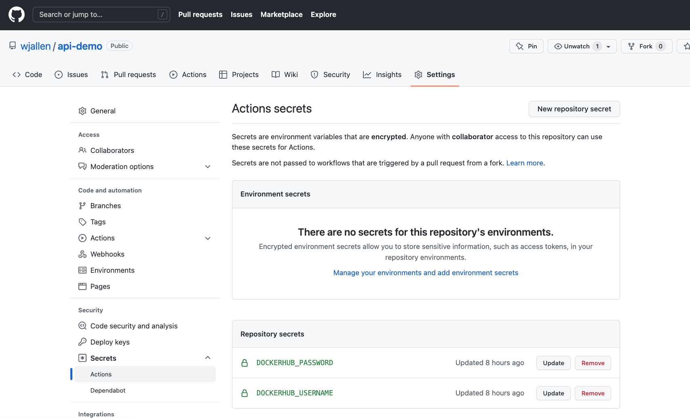

Continuous Integration
======================

In a multi-developer environment, typically no one person has complete knowledge
of the entire system, and multiple changes can be happening at the same time. Even
if the changes are made in different components, it is possible for something to
break when they are integrated.
The primary goal of Continuous Integration (CI) is to enable multiple developers
to work on the same code base while ensuring the quality of the final product.
After going through this module, students should
be able to:

* Identify the importance of CI to a large software system
* Choose a CI service that meets the needs of their software system
* Perform a integration testing CI workflow with GitHub Actions
* Perform a docker build / docker push CI workflow with GitHub Actions

An Example CI Workflow
----------------------

An "integration server" (or "build server") is a dedicated server (or VM) that
prepares software for release. The server automates common tasks, including:

* Building software binaries from source code (for compiled languages)
* Running tests
* Creating images, installers, or other artifacts
* Deploying/installing the software

We are ultimately aiming for the following "Continuous Integration" work flow or
process; this mirrors the process used by a number of teams working on "large"
software systems, both in academia and industry:

* Developers (i.e., you) check out code onto a machine where they will do their
  work. This could be a VM somewhere or their local laptop.
* They make changes to the code to add a feature or fix a bug.
* Once their work is done they add any additional tests as needed and then run
  all unit tests "locally" (i.e., on the same machine).
* Assuming the tests pass, the developer commits their changes and pushes to the
  origin (in this case, GitHub).
* A pre-established build server gets a message from the origin that a new commit
  was pushed.
* The build server:

  * Checks out the latest version
  * Executes any build steps to create the software
  * Runs unit tests
  * Starts an instance of the system
  * Runs integration tests
  * Deploys the software to a staging environment

If any one of the steps above fails, the process stops. In such a situation, the
code defect should be addressed as soon as possible.

Popular Automated CI Services
------------------------------

**Jenkins** is one of the most popular free open-source CI services. It is
server-based, and it requires a web server to operate on.

* Local application
* Completely free
* Deep workflow customization
* Intuitive web interface management
* Can be distributed across multiple machines / VMs
* Rich in features and plugins
* Easy installation thanks to the pre-installed OS X, Unix and Windows packages
* A well-established product with an excellent reputation

**TravisCI** is another CI service with limited features in the free tier, and a
comprehensive paid tier. It is a cloud-hosted service, so there is no need for
you to host your own server.

* Quick setup
* Live build views
* Pull request support
* Multiple languages and platforms support
* Pre-installed database services
* Auto deployments on passing builds
* Parallel testing (paid tier)
* Scaling capacity on demand (paid tier)
* Clean VMs for every build
* Mac, Linux, and iOS support
* Connect with Github, Bitbucket and more

**GitHub Actions** is a relatively new CI service used to automate, customize,
and execute software development workflows right in your GitHub repository.

* One interface for both your source code repositories and your CI/CD pipelines
* Catalog of available Actions you can utilize without reinventing the wheel
* Hosted services are subject to usage limits, although the free-tier limits are
  `fairly generous <https://docs.github.com/en/actions/learn-github-actions/usage-limits-billing-and-administration>`_
  (for now)
* Simple YAML descriptions of workflows, many templates and examples available
* It is a newer platform, so not as many features as some of the others, but it
  is quickly gaining steam

What Will We Do With CI?
------------------------

Two obvious and useful forms of CI we can incorporate into the development of our
final projects with GitHub Actions include:

1) Automatically run our integration tests (with pytest) each time new code is
   pushed to GitHub
2) Automatically build a Docker image and push it to Docker Hub each time our
   code is tagged with a new release

Integration Testing with GitHub Actions
---------------------------------------

To set up GitHub Actions in an existing repository, create a new folder as follows:

.. code-block:: console

   [isp02]$ mkdir -p .github/workflows/

Within that folder we will put YAML files describing when, how, and what workflows
should be triggered. For instance, create a new YAML file (``.github/workflows/integration-test.yml``)
to perform our integration testing with the following contents:

.. code-block:: yaml

    name: Integration tests with pytest
    on: [push]

    jobs:
      integration-tests-with-pytest:
        runs-on: ubuntu-latest

        steps:
        - name: Check out repo
          uses: actions/checkout@v3

        - name: Stage the data
          run: wget https://raw.githubusercontent.com/wjallen/coe332-sample-data/main/ML_Data_Sample.json

        - name: Create docker bridge network
          run: docker network create API-DB-WRK

        - name: Set up a database
          run: |
            mkdir ./data/
            docker run --name redis-db --network API-DB-WRK -p 6441:6379 -d -v ${PWD}/data:/data redis:6 --save 1 1

        - name: Build and run the API
          run: |
            docker build -f docker/Dockerfile.api -t api:test .
            docker run --name api-test --network API-DB-WRK -p 5041:5000 -d --env REDIS_IP=${RIP}  api:test
          env:
            RIP: redis-db

        - name: Build and run the worker
          run: |
            docker build -f docker/Dockerfile.wrk -t wrk:test .
            docker run --name wrk-test --network API-DB-WRK -d --env REDIS_IP=${RIP} wrk:test
          env:
            RIP: redis-db

        - name: Set up Python
          uses: actions/setup-python@v3
          with:
            python-version: "3.9"

        - name: Install dependencies
          run: pip3 install pytest==7.0.0 requests==2.27.1

        - name: Run pytest
          run: pytest

        - name: Stop images
          run: |
            docker stop wrk-test && docker rm -f wrk test
            docker stop api-test && docker rm -f api-test
            docker stop redis-db && docker rm -f redis-db
            docker network rm API-DB-WRK

The workflow above runs our integration tests, and it is triggered on every push
(``on: [push]``). This particular workflow will run in an ``ubuntu-latest`` VM,
and it has 10 total ``steps``.

Some steps contain a ``uses`` keyword, which utilizes a pre-canned action from the
catalog of GitHub Actions. For example, the pre-canned actions might be used to
clone your whole repository or install Python3. The other stops contain a ``run``
keyword which are the commands to run on the VM. In the above example, commands are
run to stage the data, set up containers, and run pytest.

QUESTION
~~~~~~~~

In the above example, Python v3.9 and external libraries (pytest, requests) are
installed in different steps. Can this be done in one step? Is there a better way
to do it?

Trigger the Integration
~~~~~~~~~~~~~~~~~~~~~~~

To trigger this integration, simply edit some source code, commit the changes,
and push to GitHub.

.. code-block:: console

   [isp02]$ git add *
   [isp02]$ git commit -m "added a new route to do something"
   [isp02]$ git push

Then navigate to the repo on GitHub and click the 'Actions' tab to watch the
progress of the Action. You can click on your saved workflows to narrow the view,
or click on a specific instance of a workflow (a "run") to see the logs.

.. figure:: images/actions_overview.png
   :width: 600
   :align: center

   History of all workflow runs.

By looking through the history of recent workflow runs, you can see that each is
assigned to a specific commit and commit message. That way, you know
who to credit or blame for successful or errant runs.

Docker Hub Integration with GitHub Actions
------------------------------------------

Rather than commit to GitHub AND push to Docker Hub each time you want to
release a new version of code, you can set up an integration between the two
services that automates it. The key benefit is you only have to commit to one
place (GitHub), and you can be sure the image on Docker Hub will always be in sync.

Consider the following workflow, located in ``.github/workflows/push-to-registry.yml``:

.. code-block:: yaml

    name: Publish Docker image

    on:
      push:
        tags:
          - '*'

    jobs:
      push-to-registry:
        name: Push Docker image to Docker Hub
        runs-on: ubuntu-latest

        steps:
          - name: Check out the repo
            uses: actions/checkout@v3

          - name: Stage the data
            run: wget https://raw.githubusercontent.com/wjallen/coe332-sample-data/main/ML_Data_Sample.json

          - name: Log in to Docker Hub
            uses: docker/login-action@f054a8b539a109f9f41c372932f1ae047eff08c9
            with:
              username: ${{ secrets.DOCKERHUB_USERNAME }}
              password: ${{ secrets.DOCKERHUB_PASSWORD }}

          - name: Set up Docker Buildx
            uses: docker/setup-buildx-action@v1

          - name: Extract metadata (tags, labels) for Docker
            id: meta-api
            uses: docker/metadata-action@98669ae865ea3cffbcbaa878cf57c20bbf1c6c38
            with:
              images: wjallen/mldata-api

          - name: Build and push Docker image
            uses: docker/build-push-action@ad44023a93711e3deb337508980b4b5e9bcdc5dc
            with:
              context: .
              push: true
              file: ./docker/Dockerfile.api
              tags: ${{ steps.meta-api.outputs.tags }}
              labels: ${{ steps.meta-api.outputs.labels }}

          - name: Extract metadata (tags, labels) for Docker
            id: meta-wrk
            uses: docker/metadata-action@98669ae865ea3cffbcbaa878cf57c20bbf1c6c38
            with:
              images: wjallen/mldata-wrk

          - name: Build and push Docker image
            uses: docker/build-push-action@ad44023a93711e3deb337508980b4b5e9bcdc5dc
            with:
              context: .
              push: true
              file: ./docker/Dockerfile.wrk
              tags: ${{ steps.meta-wrk.outputs.tags }}
              labels: ${{ steps.meta-wrk.outputs.labels }}

This workflow waits is triggered when a new tag is pushed (``tag: - '*'``). As
in the previous action, this one checks out the code and stages the sample data.
Then, it uses the ``docker/login-action`` to log in to Docker Hub on the command
line. The username and password can be set by navigating to Settings => Secrets =>
New Repository Secret within the project repository.

   Secrets are tied to specific repos.

Finally, this workflow extracts the tag from the environment and builds / pushes
the API container, then builds / pushes the worker container both using actions
from the GitHub Actions catalogue.

.. tip::

   Don't re-invent the wheel when performing GitHub Actions. There is likely an
   existing action that already does what you're trying to do.

Trigger the Integration
~~~~~~~~~~~~~~~~~~~~~~~

To trigger the build in a real-world scenario, make some changes to your source
code, push your modified code to GitHub and tag the release as ``X.Y.Z`` (whatever
new tag is appropriate) to trigger another automated build:

.. code-block:: console

   [isp02]$ git add *
   [isp02]$ git commit -m "added a new route to do something"
   [isp02]$ git push
   [isp02]$ git tag -a 0.1.1 -m "release version 0.1.1"
   [isp02]$ git push origin 0.1.1

By default, the git push command does not transfer tags, so we are explicitly
telling git to push the tag we created (0.1.1) to the remote (origin).

Now, check the online GitHub repo to make sure your change / tag is there, and
check the Docker Hub repo to see if your new tag has been pushed.

.. figure:: images/docker_hub_result.png
   :width: 600
   :align: center

   New tag automatically pushed.

Deploy to Kubernetes
--------------------

The final step in our example is to update the image tag in our deployment YAML
files in both test and prod, and apply them all. Apply to test (staging) first as
one final check that things are working as expected. Then, deploy to prod. Because
the old containers are Running right up until the moment the new containers are
deployed, there is virtually no disruption in service.

.. note::

    Some CI / CD services can even handle the deployment to Kubernetes following
    Docker image builds and passing tests.

Additional Resources
--------------------

* `GitHub Actions Docs <https://docs.github.com/en/actions>`_
* `Demo Repository <https://github.com/wjallen/api-demo>`_
