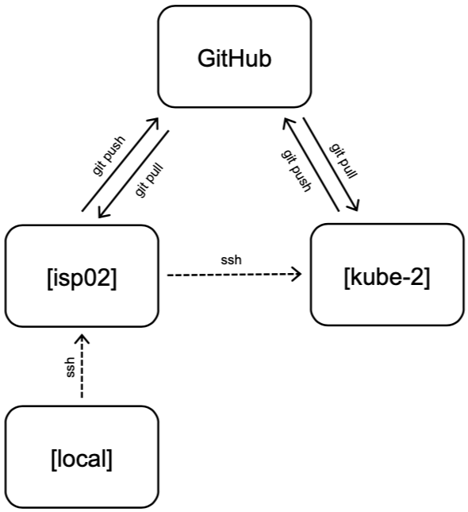

Deployment Environment
======================

Our deployment environment for this API will be the class Kubernetes cluster. It
could just as easily be AWS, or Azure, or Google Cloud, or another Kubernetes
cluster. Remember if you containerize everything, it becomes extremely portable.
In contrast to our development environment, the Kubernetes deployment is meant
to be long-lasting, highly available, and consumable by the public. We will have
`test` and `prod` deployments, so that new changes can be seen by developers in
the `test` deployment environment (sometimes also called "staging") before
finally making their way to the `prod` (production) deployment environment.
After going through this module, students should be able to:

* Name and organize YAML files for test and prod deployments of a software system
* Sync files between two remote copies of a Git repository
* Version code following semantic versioning specification
* Deploy production and test copies of software system in Kubernetes

File Organization
-----------------

To support the deployment environment (prod and test), our file tree may grow to
something similar to the following:

.. code-block:: text

    my-api/
    ├── data
    │   └── dump.rdb
    ├── docker
    │   ├── Dockerfile.api
    │   └── Dockerfile.wrk
    ├── kubernetes
    │   ├── prod
    │   │   ├── api-deployment.yml
    │   │   ├── api-service.yml
    │   │   ├── db-deployment.yml
    │   │   ├── db-pvc.yml
    │   │   ├── db-service.yml
    │   │   └── wrk-deployment.yml
    │   └── test
    │       ├── api-deployment.yml
    │       ├── api-service.yml
    │       ├── db-deployment.yml
    │       ├── db-pvc.yml
    │       ├── db-service.yml
    │       └── wrk-deployment.yml
    ├── Makefile
    ├── README.md
    └── src
        ├── api.py
        ├── jobs.py
        └── worker.py

In this example, you will find 12 new YAML files with somewhat descriptive names.
Six are organized into a 'test' directory, and six are organized into a 'prod'
directory, although there are other acceptable ways to organize these files.

These YAML files closely follow the naming convention and content we have seen
in previous lectures. There are three deployments - one each for the API, database,
and worker. There are two services - one each for the API and database. And, there
is a persistent volume claim (PVC) for the database. Without looking into the
contents of the files, it is clear what function each serves, and it is clear that
there is one-to-one correspondence between the test and prod deployments.

Test Deployment
---------------

The purpose of this testing / staging environment is to see the entire API
exactly as it appears in production before actually putting new code changes
into production.

Generally the process to get code into testing follows these steps:

1. Develop / test code in the development environment (ISP) as described in the
   previous module
2. Push code to GitHub and tag it with an appropriate version number (avoid
   using "latest" - see Versioning section below)
3. Push images to Docker Hub - Kubernetes needs to pull from here. Make sure the
   Docker image tag matches the GitHub tag so you always know what exact version
   of code is running.
4. Edit the appropriate testing deployment(s) with the new tags and apply the
   changes. Pods running within a deployment under the old tag number should be
   automatically terminated.

The yaml files above can be applied one by one, or the entire directory at a time
like the following:

.. code-block:: console

   [isp02]$ kubectl apply -f kubernetes/test/

Kubernetes will apply all the files found in the test folder. Be careful, however,
about the order in which things are applied. For example, the Redis DB deployment
needs the PVC to exist in order to deploy successfully. But, Kubernetes is usually
pretty smart about this kind of thing, so it should keep retrying all deployments,
services, and PVCs until everything is happy and connected.

Once deployed, you should rigorously test all services using the Python debug pod
and, if applicable, the NodePort Service connection to the outside world. We will
see more on automating integration tests later in this unit.

Syncing Git Repos
-----------------

A challenge you might encounter while working between the class VM (ISP) and the
Kubernetes cluster (kube-2) is keeping your Git repository in sync. If you are
doing most of your development ISP, you will need to commit and push those files
to GitHub, then clone them on to kube-2. In practice, we will likely be editing
different sets of files on the two machines (YAML files on kube-2, everything else
on ISP), but it is a good idea to stay organized and keep everything in sync. A
sample workflow may resemble:

1) Imagine the repository on GitHub is newly cloned to ISP and kube-2, and
   everything is in sync. Then, edit some files on ISP, commit changes, and push
   to GitHub:

.. code-block:: console

   [isp02]$ git add .
   [isp02]$ git commit -m "message"
   [isp02]$ git push

2) Now we would say GitHub is one commit ahead of the remote repository on kube-2.
   Log in to kube-2, and pull in the remote changes:

.. code-block:: console

   [kube-2]$ git remote update
   [kube-2]$ git pull

3) Everything is back in sync again. Next, edit some files on kube-2, commit
   changes, and push to GitHub:

.. code-block:: console

   [kube-2]$ git add .
   [kube-2]$ git commit -m "message"
   [kube-2]$ git push

4) Now we would say GitHub is one commit ahead of the report repository on ISP.
   Log back in to ISP, and pull in the remote changes:

.. code-block:: console

   [isp02]$ git remote update
   [isp02]$ git pull

Finally the origin (GitHub) and both remote copies of the repository are in sync
again. This strategy works not only for keeping copies of your own repository in
sync between multiple machines, but it also works for collaborating with others
on a repository. (Although there are
`better ways to collaborate <../unit01/version_control_2.html#collaborating-with-others>`_).

    Remember to keep remote repos synced with GitHub.

Versioning
----------

We have not spent much time discussing versioning in this class other than to see
do not use the tag 'latest' when versioning your repos or Docker images. There is
a well-accepted standard for versioning called 'Semantic Versioning'. It follows
the specification:

    Given a version number **MAJOR.MINOR.PATCH**, increment the:

    * **MAJOR** version when you make incompatible API changes,
    * **MINOR** version when you add functionality in a backwards compatible manner, and
    * **PATCH** version when you make backwards compatible bug fixes.

You can assign a tag to the current state of a repository on the command line by
doing:

.. code-block:: console

   [isp02]$ git tag -a 0.1.0 -m "first release"
   [isp02]$ git push origin 0.1.0

.. tip::

   Do you have a new software system that just kind of works and has a little bit
   of functionality, but you don't know what version tag to assign it? A good
   place to start is version 0.1.0.

Production Deployment
---------------------

If everything with the test / staging deployment looks good and passes tests,
follow the same steps for your production environment. Kubernetes is fast at
stopping / starting containers, and the services should provide pretty seamless
access to the underlying API. If larger-scale changes are needed and significant
downtime is anticipated, it would be a good idea to post an outage notice to
users.

Additional Resources
--------------------

* `Collaborate on Git Repos <../unit01/version_control_2.html#collaborating-with-others>`_
* `Semantic Versioning <https://semver.org/>`_
